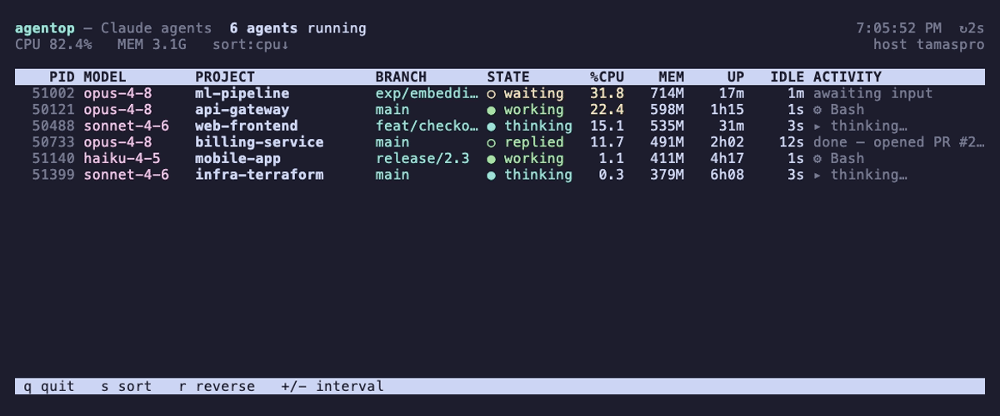

# agtop

[](https://www.npmjs.com/package/agtop)
[](https://github.com/ktamas77/agtop/actions/workflows/ci.yml)
[](LICENSE)

> `top`, but for your running **Claude Code agents**.

A zero-dependency terminal dashboard that shows every `claude` CLI session
running on your machine — live, refreshing like `top`/`htop`. See at a glance
which projects have agents working, what model they're on, which git branch
they're on, and what each one is doing *right now* (running a tool, thinking,
or waiting for you).



## Usage

No install needed — run it with `npx`:

```sh
npx agtop
```

Or install globally:

```sh
npm install -g agtop
agtop
```

### Live keys

| Key | Action |
|-----|--------|
| `q` / `Esc` / `Ctrl-C` | Quit |
| `s` | Cycle the sort column |
| `r` | Reverse the sort order |
| `+` / `-` | Increase / decrease the refresh interval |

### Options

```
-d, --interval <sec>   Refresh interval in seconds (default: 2)
-s, --sort <key>       Sort by: cpu, mem, up, idle, project, pid (default: cpu)
-r, --reverse          Reverse sort order
-n, --once             Print a single snapshot and exit (no live UI)
    --json             Print agents as JSON and exit
    --no-color         Disable ANSI colors
-h, --help             Show help
-v, --version          Show version
```

`--once` and `--json` make `agtop` scriptable:

```sh
agtop --json | jq '.[] | select(.state == "working") | .project'
watch -n5 'agtop --once'
```

## Columns

| Column | Meaning |
|--------|---------|
| **PID** | OS process id of the `claude` CLI session |
| **MODEL** | Model the session is using (e.g. `opus-4-8`) |
| **PROJECT** | Working directory basename of the agent |
| **BRANCH** | Git branch the session is on |
| **STATE** | `working` (running a tool) · `thinking` · `replied` · `waiting` · `idle` · `stalled` |
| **%CPU** | Process CPU usage |
| **MEM** | Resident memory |
| **UP** | How long the process has been running |
| **IDLE** | Time since the last transcript activity |
| **ACTIVITY** | What the agent is doing right now (current tool, prompt, …) |

## How it works

`agtop` reads only local state — nothing is sent anywhere:

1. It lists running **`claude` CLI processes** with `ps` (the desktop app and
   its helpers are filtered out), and resolves each one's working directory
   via `/proc` on Linux or `lsof` on macOS.
2. It joins each process to its **session transcript** under
   `~/.claude/projects/<encoded-cwd>/<session>.jsonl`, matching on the working
   directory.
3. It reads just the **tail** of each matching transcript to extract the model,
   git branch, version, last-activity time, and current tool call — then renders
   it all as a `top`-style table.

## Requirements

- Node.js ≥ 16 to run (the dev test suite uses Node's built-in runner, which needs ≥ 18)
- macOS or Linux (`ps`, plus `lsof` on macOS)

## Development

```sh
npm install        # also installs the Husky pre-commit hook
npm test           # unit + CLI tests (node --test, run in parallel)
npm run lint       # eslint
npm run typecheck  # tsc --noEmit (type-checks the JS via JSDoc/inference)
npm run format     # prettier --write
npm run check      # format:check + lint + typecheck + test (what CI runs)
```

A Husky **pre-commit** hook runs `lint-staged` (Prettier + ESLint on staged
files), then the type-check and the full test suite. CI runs the same checks as
independent parallel jobs (`format`, `lint`, `typecheck`, and a `test` matrix
across macOS/Linux × Node 18/20/22).

## License

MIT © Tamas Kalman
